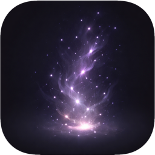

# Wisp

Beautiful ambient particle effects for your macOS desktop.



**Website:** [wisp.gruffix.ru](https://wisp.gruffix.ru/)
**Download:** [Latest release](https://github.com/GruFFix/Wisp/releases/latest)

## Features

- 6 color themes — Golden, Rose, Moonlight, Aurora, Sapphire, and a custom 3-color picker
- Full control over density, speed, size, opacity, lifespan and drift
- Joystick-style wind direction control
- Additive glow blend mode
- Multi-monitor support
- Pause on battery / sleep / screen lock
- Exclude particles from screenshots and screen recordings
- Launch at login
- Auto-updates via Sparkle
- Free and unlocked — no trial, no paywall

## Requirements

- macOS 14 Sonoma or later
- Apple Silicon or Intel

## Install

1. Download `Wisp-1.0.dmg` from [releases](https://github.com/GruFFix/Wisp/releases/latest)
2. Open the DMG and drag Wisp into Applications
3. First launch — right-click Wisp in Applications → **Open** → **Open** (required because the app isn't yet notarized by Apple)
4. Wisp appears in the menu bar as a ✦ icon

## Build from source

```bash
brew install xcodegen create-dmg
git clone https://github.com/GruFFix/Wisp.git
cd Wisp
make run        # debug build + launch
make dmg        # release DMG
```

## Architecture

- **Language:** Swift 5.9 + SwiftUI + AppKit
- **Particle engine:** `CAEmitterLayer` with multiple cell types per color group
- **Menu bar UI:** `NSPanel` (nonactivating, borderless)
- **Auto-update:** Sparkle 2
- **Build:** XcodeGen (`project.yml`) + `xcodebuild`

## License

MIT — see [LICENSE](LICENSE).
